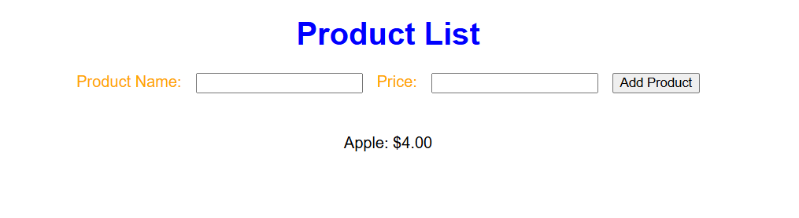
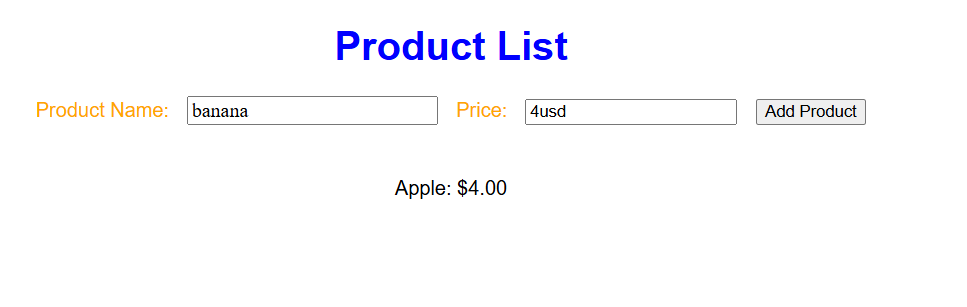
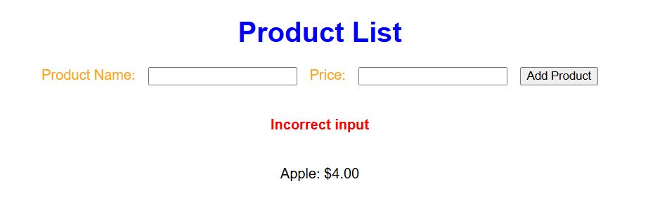

# Adding Products

The project gets the name of a product, and adds it to a list using Node JS.

# Libraries Used
- ejs
- express

# Screenshots

## Opening Page

## Adding a Product

## Adding an Invalid Product (Invalid Price)

